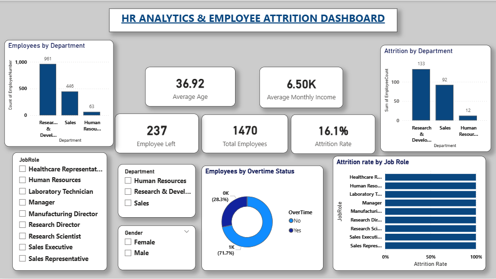
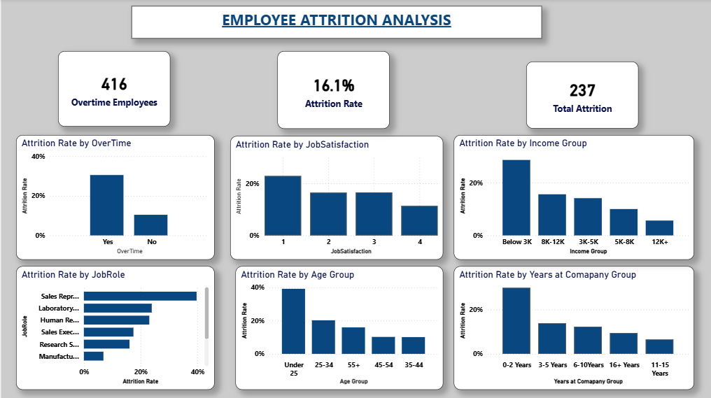
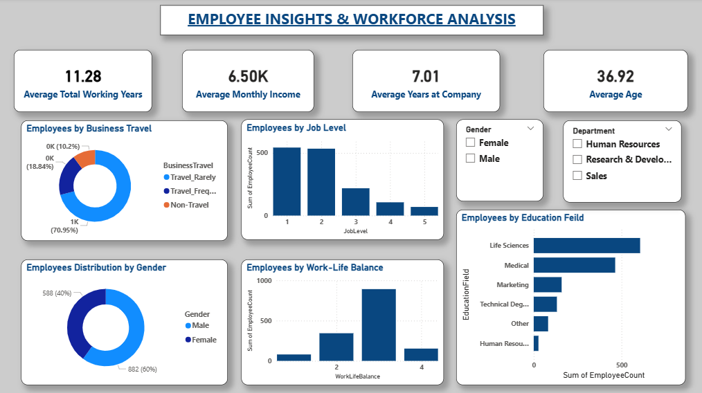
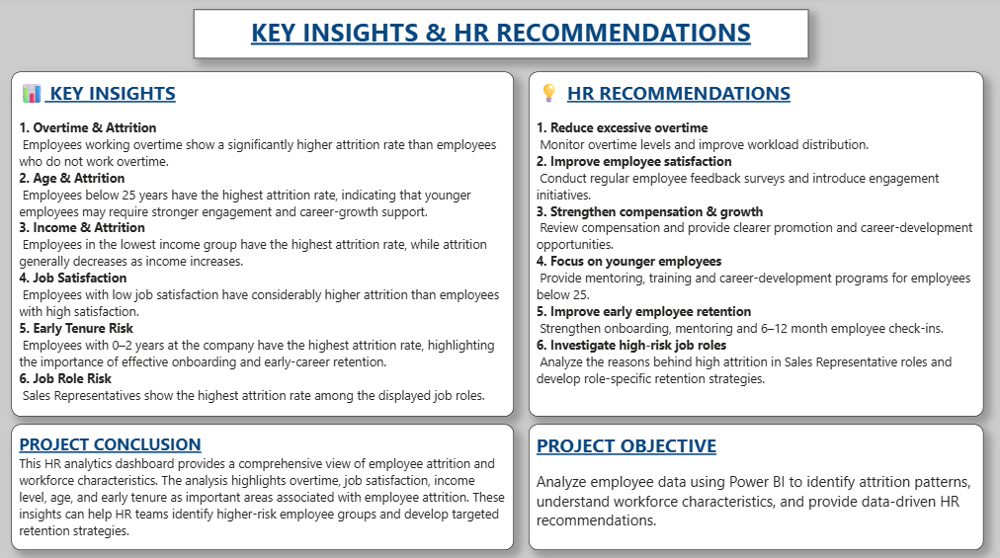

# 📊 HR Analytics & Employee Attrition Dashboard

## 📌 Project Overview

This project is an interactive **HR Analytics and Employee Attrition Dashboard** developed using **Microsoft Power BI**.

The objective of this project is to analyze employee attrition patterns, understand workforce characteristics, identify higher-risk employee groups, and provide data-driven HR recommendations.

## 🎯 Project Objectives

- Analyze overall employee attrition
- Identify factors associated with employee turnover
- Analyze the impact of overtime on attrition
- Study attrition based on job satisfaction
- Analyze attrition across age and income groups
- Understand attrition by years at company
- Identify job roles with higher attrition
- Provide HR retention recommendations

## 🛠️ Tools & Technologies

- **Microsoft Power BI**
- **DAX**
- **Data Analysis**
- **Data Visualization**
- **Dashboard Design**

## 📊 Dashboard Pages

### 1. HR Overview

Provides an overall view of the workforce, including:

- Total Employees
- Employees Left
- Attrition Rate
- Average Age
- Average Monthly Income
- Employees by Department
- Attrition by Department
- Attrition Rate by Job Role
- Overtime Distribution

### 2. Employee Attrition Analysis

Analyzes employee attrition based on:

- Overtime
- Job Satisfaction
- Age Group
- Income Group
- Years at Company
- Job Role

### 3. Employee Insights & Workforce Analysis

Analyzes workforce characteristics such as:

- Gender
- Business Travel
- Education Field
- Job Level
- Work-Life Balance
- Average Working Years
- Average Years at Company

### 4. Key Insights & HR Recommendations

Summarizes the major findings from the analysis and provides recommendations for improving employee retention.

## 🔍 Key Findings

- Overall employee attrition rate was **16.1%**.
- Employees working overtime showed considerably higher attrition.
- Lower job satisfaction was associated with higher attrition.
- Employees below 25 years showed higher attrition.
- Lower-income groups showed higher attrition.
- Employees in the early years of employment showed higher attrition.
- Sales Representative was among the higher-attrition job roles.

## 💡 HR Recommendations

- Monitor and reduce excessive overtime.
- Improve employee engagement and job satisfaction.
- Review compensation and career-growth opportunities.
- Provide mentoring and career support for younger employees.
- Strengthen onboarding and early-tenure retention programs.
- Investigate high-attrition job roles and develop role-specific retention strategies.

## 🖼️ Dashboard Preview

### HR Overview

### Employee Attrition Analysis

### Employee Insights

### Key Insights & Recommendations

## 👩‍💻 Project By

**Pragya Parashar**

BCA Student | Aspiring Data Analyst

**Skills:** Power BI | DAX | Data Analysis | Data Visualization
